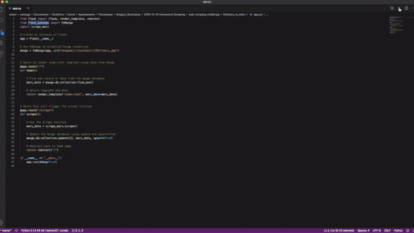

# Mars Facts and Images Scraped from Multiple Sources

---

## Project Description

The goal of the project is to scrape the multiple web sources with information and images about Mars and NASA, store it in a database and finally display it in a customized web site. For this project, a flask server was created to scrape a series of URLs described below, the information was stored in a `MongoDB`database and the information was displayed into a website. A screenshot of the final result is presented below too.

## Sample website

## Scraped Urls

- [NASA Mars News (text)](https://mars.nasa.gov/news/)
- [JPL Mars Space Images - Featured Image (image)](https://www.jpl.nasa.gov/spaceimages/?search=&category=Mars)
- [Mars Weather (text)](https://twitter.com/marswxreport?lang=en)
- [Mars Facts (table)](https://space-facts.com/mars/)
- [Mars Hemispheres (images)](https://astrogeology.usgs.gov/search/results?q=hemisphere+enhanced&k1=target&v1=Mars)

---

## Necessary Steps to Run all the Project

1. Install or have installed these libraries in your Git Environment:
        -   pandas
        -   splinter
        -   bs4
        -   urllib.parse
        -   time
        -   flask
        -   flask_pymongo
2. Download or have downloaded the chromedriver.exe in the path "/usr/local/bin/chromedriver" for Mac Users
3. Run the `Mongo daemon`, in one terminal window run `~/mongodb/bin/mongod`. This will start the Mongo server.
4. Run the `\Missions_to_Mars\app.py` file
5. Open your browser and visit the URL: `http://127.0.0.1:5000/`

---

## File Description

### - `Missions_to_Mars\`

#### - `app.py`

- Contains Python app that uses the flask library that runs the server in the URL: `http://127.0.0.1:5000/` and calls the `Missions_to_Mars\templates\index.html` file

#### - `mission_to_mars.ipynb`

- Contains the Jupyter Notebook with the explained code for scrapping the different URLs used in the project

#### - `scrape_mars`

- Contains Python routine used and called by the main routine `\Missions_to_Mars\app.py` and it is called by pressing the `Scrape New Data`button in the URL: `http://127.0.0.1:5000/`

#### -  `ScreenShots`

- `1. Initial.png` - It is the screenshot of the initial state of the `Missions_to_Mars\templates\index.html` file `before` running the `Scrape New Data` button which calls the `\Missions_to_Mars\scrape_mars.py` routine
- `2. Final.png` - It is the screenshot of the final state of the `Missions_to_Mars\templates\index.html` file `after` running the `Scrape New Data`button which calls the `\Missions_to_Mars\scrape_mars.py` routine

#### -  `templates`

- `index.html` - Contains the HTML and CSS codes necessary for the presentation of the scrapped data obtained by `Scrape New Data`button which calls the `\Missions_to_Mars\scrape_mars.py` routine
